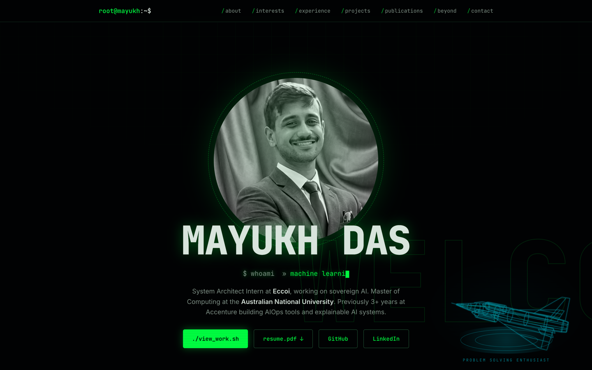
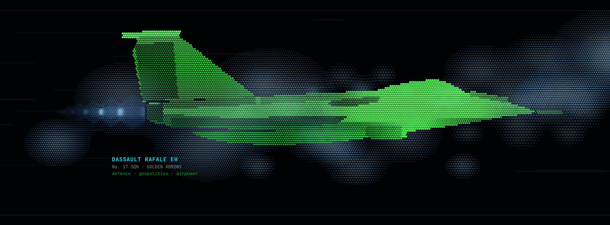
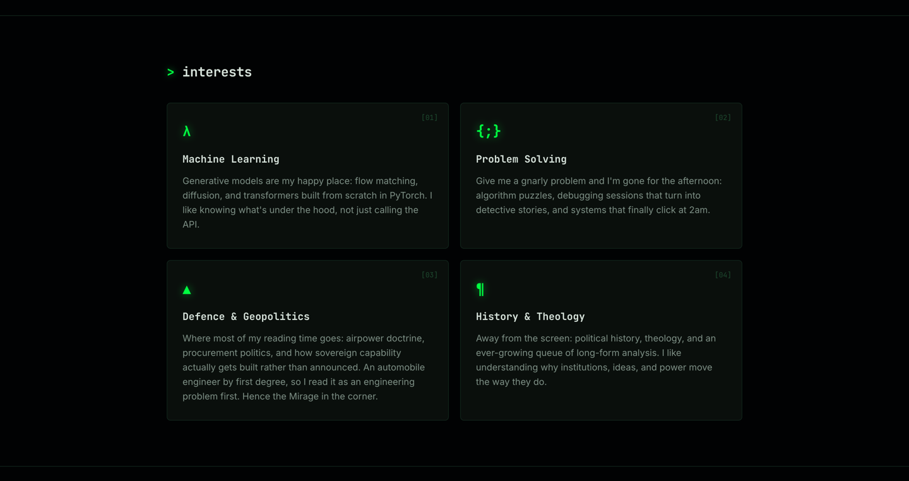
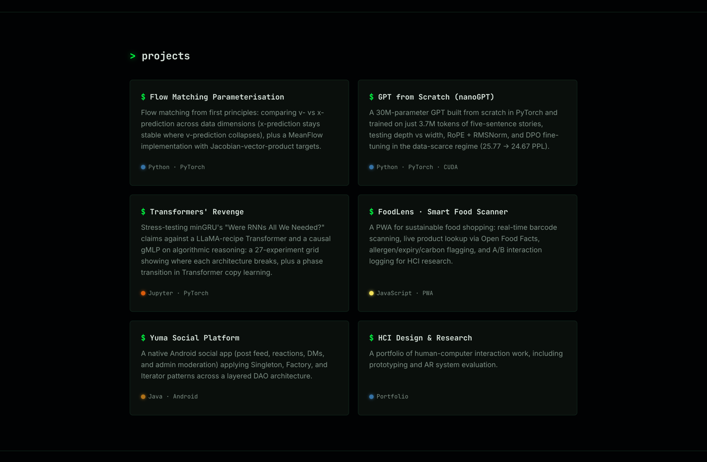
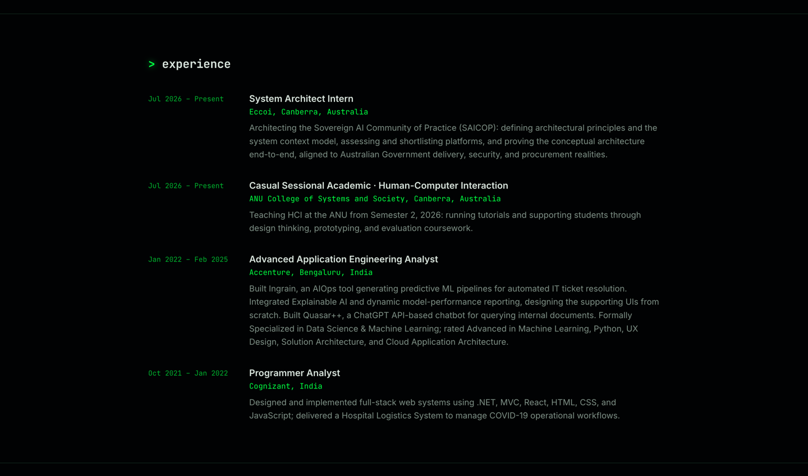
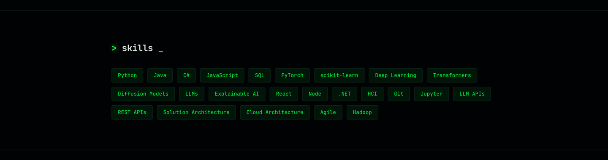
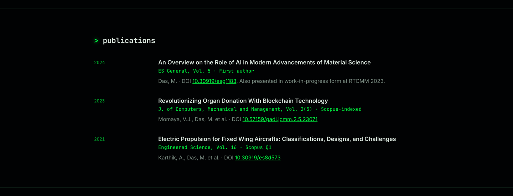
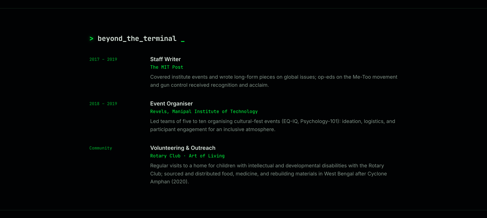
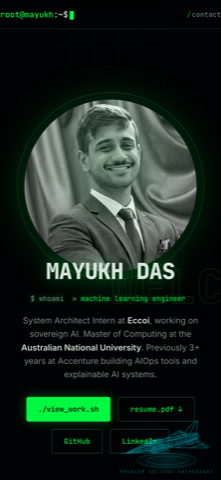

# mayukh-d.github.io

My personal portfolio: a single-page, terminal-themed site built with plain HTML, CSS, and
JavaScript. No frameworks, no build step, no dependencies. One `index.html` file plus a
handful of static assets, served straight off GitHub Pages. The one moving part is the
optional "ask me anything" terminal, backed by a small Cloudflare Worker in
[`chat-worker/`](chat-worker/).

**Live at [mayukh-d.github.io](https://mayukh-d.github.io/)**



## What's in it

The page runs top to bottom as a single scroll: about, skills, experience, projects,
education, publications, student roles, internships, interests, beyond_the_terminal, and
contact. Two hand-rolled canvas pieces carry the visual identity, and everything else is
CSS.

### Defence and geopolitics

A dot-matrix Dassault Rafale EH in No. 17 Squadron "Golden Arrows" markings closes the page,
drawn cell by cell on a canvas with procedurally generated cloud volumes drifting behind it.



### Interests



### Projects

Six projects, each linking out to its own repository, plus live demos (a Hugging Face Space
for the nanoGPT story generator, a hosted build of FoodLens) and PDF write-ups for the ML
work under `assets/reports/`.



### Experience



### Skills



### Publications

Three papers on AI in material science, blockchain, and electric propulsion, with DOIs.



### Beyond the terminal



### Mobile

The layout collapses to a single column and the nav trims to a contact link.



## Implementation notes

- **Draggable U-TAE hologram.** A wireframe of the U-TAE (a U-Net with temporal attention)
  behind my canopy mapping work: a stack of dated satellite tiles in, encoder maps with a
  ghost frame per date, a temporal attention node at the bottleneck whose masks reach every
  skip connection, and a canopy map out. Rotated with quaternions and slerped
  between orientations. Drag it to spin; flick it and it keeps its angular momentum until
  friction settles it back to a resting pose.
- **Rafale canvas.** The airframe is defined as a set of tonal polygons, sampled onto a
  hex-packed dot grid. Clouds are pre-rendered to offscreen canvases from a seeded PRNG, so
  the same sky comes back on every load.
- **Scroll reveals.** An IntersectionObserver-free sweep on scroll, with a staged entrance
  for the hero and a polling fallback for the case where fonts land late.
- **Reduced motion.** Both canvases render a single static frame and the reveals resolve
  immediately when `prefers-reduced-motion: reduce` is set.
- **Email.** The contact address is assembled in JavaScript at runtime rather than sitting
  in the markup, which keeps it away from the simpler scrapers.
- **Typography.** Inter and JetBrains Mono from Google Fonts, preconnected. Everything else
  is self-hosted.

## Layout

```
index.html                  the entire site: markup, styles, and scripts
favicon.ico
assets/
  mayukh.jpg                hero portrait
  og-image.png              social card
  favicon.svg, favicon-32.png, apple-touch-icon.png
  Mayukh_Das_Resume.pdf
  reports/                  project write-ups linked from the projects section
  screenshots/              the images used in this README
```

## Running it locally

There is no build step. Open the file directly:

```sh
open index.html
```

Or serve it, which is closer to how GitHub Pages behaves for the root-relative favicon:

```sh
python3 -m http.server 8000
# then visit http://localhost:8000
```

## Deploying

GitHub Pages builds from the default branch. Push to it and the live site updates within a
minute or so.

## Ask-me-anything terminal

Click the blinking `root@mayukh:~$` prompt to open a terminal. Built-in commands (`help`,
`whoami`, `ls projects`, `cat pytorch`, `experience`, `contact`) answer instantly from the
page itself. Anything else goes to [`chat-worker/`](chat-worker/), a Cloudflare Worker that
asks Google Gemini to answer **only** from `chat-worker/profile.md`, which
`build-profile.mjs` generates from `index.html`, so the bot can't drift from what the page
says. The Gemini key lives in the Worker as a secret; visitors are rate-limited per IP and
only this site's origin is accepted.

```bash
cd chat-worker
npm install
npm test                                 # worker unit tests
npx wrangler login                       # once
npx wrangler secret put GEMINI_API_KEY   # once; paste the key at the prompt
npm run deploy                           # rebuilds profile.md, then deploys
```

After editing the site, run `npm run deploy` again so the bot learns the changes.

